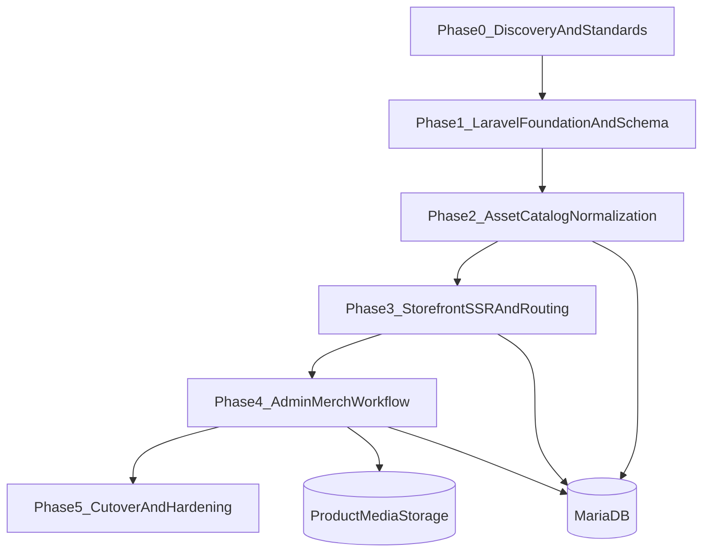

# Detailed Plan: Laravel + MariaDB + Cloudways + Product Asset Ingestion

## Final Architecture Choice

- **Rendering model**: Laravel monolith (SSR-first) for maintainability/scalability.
- **Slug routing**: Rewrite `/products/{slug}/` to Laravel routes/controllers.
- **Data source**: MariaDB 10.11 as single source of truth.
- **Admin goal**: Fast, reliable merchandising UX for apparel (sizes/colors, descriptions, images).

## Phase 0 — Discovery, Naming Standards, and Migration Contracts

### Objectives

- Define immutable rules before coding: product naming, slug policy, variant model, media naming, and required content fields.
- Create a migration contract from current sources:
- Legacy JSON: [`src/_data/products.json`](src/_data/products.json)
- Legacy APIs/admin: [`src/api/products-save.php`](src/api/products-save.php), [`src/assets/js/admin.js`](src/assets/js/admin.js), [`src/admin/index.njk`](src/admin/index.njk)
- New source folder: `C:\Users\GamingPC\Desktop\Be Better Website Photos`

### Deliverables

- Data contract document (fields, constraints, defaults, nullability).
- Variant policy: `size` + `color` required for apparel SKUs.
- Canonical slug rules (lowercase, hyphenated, uniqueness conflict strategy).
- Media naming convention (e.g., `productSlug-color-view-index.ext`).

### Edge cases to explicitly define

- Duplicate/near-duplicate filenames (`(1)`, `-2`, spacing variants).
- Ambiguous color names (`blk`, `black`, `wht`, `white`) mapping to canonical values.
- Same product image shot by different people in file names (`(Jake)`, `(Katy)`) and whether to keep as metadata.
- Products missing description/price/tags.
- Legacy products with no variant structure but with single `image` field.

### Documentation checkpoints

- Laravel conventions (structure and naming): [Laravel Docs](https://laravel.com/docs)
- Slug normalization and validation rules: [Laravel Validation](https://laravel.com/docs/validation)
- MariaDB collation/charset decisions (utf8mb4): [MariaDB Docs](https://mariadb.com/kb/)

---

## Phase 1 — Laravel Foundation, Schema, and Import Pipeline

### Objectives

- Bootstrap Laravel app for Cloudways deployment and connect to MariaDB 10.11.
- Implement normalized catalog schema and robust import jobs.

### Implementation scope

- App setup and environment wiring (`APP_KEY`, DB credentials, filesystem).
- Migrations/models:
- `products` (title, slug unique, subtitle, description_long, status, seo fields, base price)
- `product_variants` (product_id, color, size, sku unique, price, compare_at, is_active)
- `product_images` (product_id, variant_id nullable, path, alt_text, sort_order, role)
- `collections`, `product_collection`
- `tags`, `product_tag`
- optional `audit_logs` for admin actions
- Import commands:
- Import legacy JSON first as baseline.
- Import/merge media references from normalized catalog generated in Phase 2.
- DB indexing strategy:
- unique indexes: `products.slug`, `product_variants.sku`
- query indexes: `(status, slug)`, pivots, `(product_id, sort_order)`

### Edge cases to test

- Slug collisions across similarly named products.
- Variant SKU collisions when generating from size/color combinations.
- Price parsing anomalies (`"68"`, `"68.00"`, currency symbols).
- Missing compare-at price and nullable fields.
- Import reruns (idempotency: no duplicate inserts).

### Documentation checkpoints

- Migrations and schema patterns: [Laravel Migrations](https://laravel.com/docs/migrations)
- Eloquent relationships and pivots: [Laravel Eloquent Relationships](https://laravel.com/docs/eloquent-relationships)
- Queued/batch import jobs if needed: [Laravel Queues](https://laravel.com/docs/queues)

---

## Phase 2 — Organize and Ingest Existing Product Assets (New dedicated phase)

### Objectives

- Convert `C:\Users\GamingPC\Desktop\Be Better Website Photos` into a clean, structured product media catalog ready for DB import.
- Resolve file ambiguity and map each image to product + color + view type.

### Implementation scope

- Build an ingestion script/command to:
- Scan all image files and parse candidate metadata from filenames.
- Normalize product/color tokens (e.g., `blk -> black`, `wht -> white`).
- Detect duplicates via hash + perceptual similarity candidate flags.
- Emit a reviewable manifest (CSV/JSON): `original_file`, `normalized_product`, `color`, `view`, `is_duplicate_candidate`, `target_filename`.
- Create curated storage structure (example):
- `storage/app/public/products/{productSlug}/{color}/{filename}`
- Extract description content from `Apparel Descriptions.docx` into structured fields (manual QA assisted):
- short subtitle
- long description
- care/material notes (if present)
- Human review loop before final import:
- Approve unresolved mappings and duplicates.
- Confirm alt text and primary image order.

### Edge cases to test

- Multiple files differing only by whitespace/parentheses.
- Inconsistent product names across files (e.g., `OG Better Hoodie` variants).
- Image orientation and oversized dimensions.
- Transparent PNG logos accidentally assigned as product photos.
- Product color exists in files but not in variant matrix.

### Documentation checkpoints

- Laravel filesystem/storage links: [Laravel Filesystem](https://laravel.com/docs/filesystem)
- Image processing recommendations (if using intervention/image package docs)
- Metadata extraction SOP (internal checklist for manual QA of mapping decisions)

---

## Phase 3 — Storefront SSR + Rewrite Routing + SEO Integrity

### Objectives

- Replace legacy JSON-driven rendering with DB-backed SSR for PDP, collections, and search.
- Enforce clean canonical routing for `/products/{slug}/`.

### Implementation scope

- Routes/controllers:
- `/products/{slug}/`
- `/collections/{slug}/`
- `/search?q=`
- Blade views matching core UX from current templates:
- card/grid behavior from [`src/_includes/components/product-card.njk`](src/_includes/components/product-card.njk)
- PDP gallery/variant behavior from [`src/_includes/layouts/product.njk`](src/_includes/layouts/product.njk)
- Apache and Laravel rewrite alignment:
- maintain HTTPS enforcement behavior currently in [`src/.htaccess`](src/.htaccess)
- prevent collisions with static files/assets
- SEO basics:
- canonical tags
- product not-found returns 404
- noindex for draft/unpublished products

### Edge cases to test

- Trailing slash normalization and duplicate URL variants.
- Slugs that match reserved paths (`admin`, `api`, `search`).
- Deleted products still requested by old links (custom 404 suggestions).
- Empty collections and empty search results.

### Documentation checkpoints

- Laravel routing + route model binding: [Laravel Routing](https://laravel.com/docs/routing)
- Blade templating best practices: [Laravel Blade](https://laravel.com/docs/blade)
- Cloudways Apache rewrite guidance: [Cloudways Docs](https://support.cloudways.com/)

---

## Phase 4 — Admin Experience (Merchandising-first UX)

### Objectives

- Deliver an admin that makes product setup genuinely fast for apparel: descriptions, variant matrix, and media assignment.

### Implementation scope

- Auth + authorization:
- secure login with roles/permissions (admin/editor)
- Product editor UX:
- Basics tab: title/slug/subtitle/description/status/collections/tags
- Variants tab: color/size matrix generator (bulk add combinations)
- Pricing tab: base + variant overrides, compare-at
- Media tab: drag-drop uploads, reorder, set primary, map image to color variant
- Preview tab: storefront PDP preview before publish
- Batch merchandising utilities:
- clone product
- bulk edit prices by collection/tag
- deactivate variant(s) without deleting history
- Validation UX:
- inline errors and conflict explanations (slug/SKU uniqueness)

### Edge cases to test

- Changing slug after publish (redirect strategy vs hard switch).
- Deleting color that still has mapped images/variants.
- Upload interruption and partial media state.
- Simultaneous edits from two admins (optimistic lock/version check).

### Documentation checkpoints

- Form requests + validation messages: [Laravel Validation](https://laravel.com/docs/validation)
- Authorization policies: [Laravel Authorization](https://laravel.com/docs/authorization)
- File upload security controls (mime/size/virus scan policy if added)

---

## Phase 5 — Cutover, Legacy Decommission, Performance, and Ops

### Objectives

- Switch production safely from legacy runtime to Laravel while preserving availability and data quality.

### Implementation scope

- Cutover runbook:
- freeze legacy writes
- final data/media delta import
- switch routing/application target
- smoke test critical URLs
- Legacy retirement sequence:
- deprecate endpoints in [`src/api/products-get.php`](src/api/products-get.php), [`src/api/products-save.php`](src/api/products-save.php), [`src/api/upload-image.php`](src/api/upload-image.php)
- retire client live-feed dependencies in [`src/assets/js/main.js`](src/assets/js/main.js), [`src/assets/js/search.js`](src/assets/js/search.js)
- Hardening:
- caching strategy for collection/search pages
- DB query profiling and index tuning
- backup/restore drills for DB + media
- structured logging and alerting

### Edge cases to test

- Cache stale product after update/publish.
- Rollback path if cutover fails midway.
- Missing media files on one server node (if multi-node setup).
- Permission issues in storage directories after deployment.

### Documentation checkpoints

- Laravel cache + config optimization: [Laravel Cache](https://laravel.com/docs/cache)
- Laravel deployment checklist: [Laravel Deployment](https://laravel.com/docs/deployment)
- Cloudways backup/restore and cron docs: [Cloudways Docs](https://support.cloudways.com/)

---

## Test & Acceptance Matrix (applies across phases)

- Product lifecycle: create -> publish -> edit -> unpublish -> delete/archived behavior.
- Variant correctness: every displayed size/color corresponds to a valid active variant.
- Media correctness: primary image, variant image mapping, fallback image behavior.
- URL/SEO integrity: canonical routes, redirects, 404 handling.
- Admin quality: < 5 minutes to create a new apparel product with 2 colors x 4 sizes x 4 images.

## Data Sources Included in this plan

- Existing catalog JSON: [`src/_data/products.json`](src/_data/products.json)
- Existing runtime/admin code: [`src/admin/index.njk`](src/admin/index.njk), [`src/assets/js/admin.js`](src/assets/js/admin.js)
- New asset repository: `C:\Users\GamingPC\Desktop\Be Better Website Photos` (39 image files + `Apparel Descriptions.docx`)

## Assumptions

- Payment/checkout system remains out of scope for this migration.